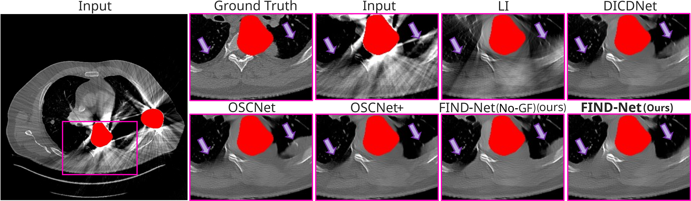
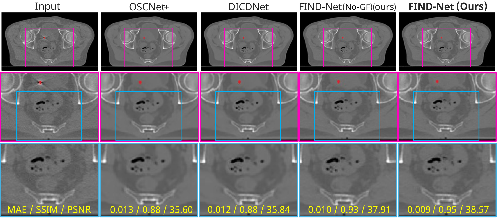

# FIND-Net: Fourier-Integrated Network with Dictionary Kernels for Metal Artifact Reduction
FIND-Net (Fourier-Integrated Network with Dictionary Kernels) is a deep learning model for Metal Artifact Reduction (MAR) in CT imaging. It integrates Fast Fourier Convolution (FFC) and trainable Gaussian filtering to suppress artifacts while preserving anatomical structures. 


## Features
- **Iterative Hybrid Frequency-Spatial MAR framework**: Integrates **Fast Fourier Convolution (FFC)** for improved feature extraction.  
- **Trainable Gaussian Filtering**: Enhances frequency selectivity while preserving critical anatomical details.  
- **Efficient MAR Performance**: Reduces metal artifacts while maintaining high structural fidelity.  
- **Benchmark Comparisons**: Achieves state-of-the-art results against existing MAR methods.


## Overview
FIND-Net is a deep learning-based framework for **Metal Artifact Reduction (MAR)** in CT imaging. It extends the **DICDNet** architecture by incorporating **Fourier domain processing** and **trainable Gaussian filtering**, enhancing artifact suppression while preserving anatomical structures.


## Abstract
Metal artifacts, caused by high-density metallic implants in computed tomography (CT) imaging, severely degrade image quality, complicating diagnosis and treatment planning. While existing deep learning algorithms have achieved notable success in Metal Artifact Reduction (MAR), they often struggle to suppress artifacts while preserving structural details. To address this challenge, we propose FIND-Net (Fourier-Integrated Network with Dictionary Kernels), a novel MAR framework that integrates frequency and spatial domain processing to achieve superior artifact suppression and structural preservation. 
FIND-Net incorporates Fast Fourier Convolution (FFC) layers and trainable Gaussian filtering, treating MAR as a hybrid task operating in both spatial and frequency domains. This approach enhances global contextual understanding and frequency selectivity, effectively reducing artifacts while maintaining anatomical structures. Experiments on synthetic datasets show that FIND-Net achieves statistically significant improvements over state-of-the-art MAR methods, with a 3.07\% MAE reduction, 0.18\% SSIM increase, and 0.90\% PSNR improvement, confirming robustness across varying artifact complexities. Furthermore, evaluations on real-world clinical CT scans confirm FIND-Net’s ability to minimize modifications to clean anatomical regions while effectively suppressing metal-induced distortions. These findings highlight FIND-Net’s potential for advancing MAR performance, offering superior structural preservation and improved clinical applicability.

## Network Architecture
FIND-Net improves MAR by integrating **frequency-based processing** into its iterative refinement framework. Instead of relying solely on spatial convolutions, it incorporates **Fast Fourier Convolution (FFC)** to capture both local and global frequency characteristics. This hybrid approach enhances artifact suppression while preserving fine anatomical details.

The architecture consists of two key components:
- **M-Net**: Estimates metal artifacts using frequency-enhanced features.
- **X-Net**: Progressively refines the reconstructed image by filtering residual artifacts in both spatial and frequency domains.

To further improve **frequency adaptability**, FIND-Net employs **trainable Gaussian filtering** in the frequency domain, dynamically adjusting filtering parameters during training. This ensures that the model selectively enhances important frequency components while suppressing noise and irrelevant patterns. 


## Installation
To use FIND-Net, clone this repository and install the required dependencies:

```sh
git clone https://github.com/yourusername/FIND-Net.git
cd FIND-Net
pip install -r requirements.txt
```

FIND-Net's dataloader relies on the CatSim package for X-ray CT simulation. To install CatSim, follow the official installation guide:
https://github.com/xcist/documentation/wiki/How-to-install-CatSim-Python-package

## Usage
### Testing the Model

To evaluate FIND-Net on a test dataset, use the provided `test.sh` script, which automates the setup and execution of the testing process.

#### **Step 1: Configure the Model Selection**
Before running the test script, ensure that the correct model configuration is set:

1. **Choose a model directory** (`MODEL_DIRECTORY` in `test.sh`):
   - **`FINDNet`** → Standard FIND-Net model  
   - **`FINDNet_no_GF`** → FIND-Net without Gaussian filtering  
   - **`DICDNet`** → Baseline DICDNet model  

2. **Modify `ProxNet.py` settings (located in the `Model` folder)**:
   - For **FINDNet** or **FINDNet_no_GF**:
     ```python
     FINDNet_Mnet = True
     FINDNet_Xnet = True
     ```
   - For **DICDNet**:
     ```python
     FINDNet_Mnet = False
     FINDNet_Xnet = False
     ```

3. **Modify `ffc.py` settings (located in the `Model` folder)**:
   - For **FINDNet** (with Gaussian filtering enabled):
     ```python
     Gaussian_filter = True
     ```
   - For **FINDNet_no_GF** (without Gaussian filtering):
     ```python
     Gaussian_filter = False
     ```

#### **Step 2: Execute the Test Script**
Once the configurations are correctly set, run the following command in the terminal:

```sh
bash test.sh
```

## Quantitative Evaluation on Synthetic Data
### Performance Comparison of MAR Approaches
| Methods         | Large Metal | Medium Metal | Small Metal | Average |
|---------------|---------------------|---------------------|---------------------|---------------------|
| **Linear Interpolation**        | 35.5 / 0.866 / 35.9 | 29.6 / 0.899 / 38.1 | 23.4 / 0.929 / 39.9 | 26.6 / 0.913 / 38.9 |
| **DICDNet (Baseline)**   | 23.9 / 0.918 / 38.7 | 21.1 / 0.941 / 41.2 | 15.6 / 0.962 / 43.8 | 18.3 / 0.951 / 42.4 |
| **OSCNet**    | 23.2 / 0.920 / 39.0 | 21.9 / 0.938 / 40.4 | 16.2 / 0.959 / 42.9 | 18.8 / 0.948 / 41.7 |
| **OSCNet+**   | 23.5 / 0.918 / 39.0 | 21.9 / 0.938 / 40.8 | 16.2 / 0.959 / 43.2 | 18.8 / 0.948 / 42.0 |
| **FIND-Net (w/o GF)** | 24.0 / 0.917 / 38.7 | 21.0 / 0.941 / 41.3 | 15.5 / 0.962 / 43.8 | 18.2 / 0.951 / 42.5 |
| **FIND-Net**  | **22.9** / **0.925** / **39.2** | **20.9** / **0.942** / **41.4** | **15.2** / **0.963** / **44.3** | **17.9** / **0.952** / **42.8** |


**Table:** Performance comparison of different MAR approaches in terms of **MAE ↓ / SSIM ↑ / PSNR ↑** across varying metal sizes.


### Performance Improvements

Below is a comparison of **MAE, SSIM, and PSNR** improvements (%) across MAR models, relative to DICDNet.


**Figure:** Boxplot comparison of MAE, SSIM, and PSNR improvements (%) across MAR models, relative to DICDNet. Overall distributions are shown, with zoomed-in views highlighting FIND-Net and FIND-Net without Gaussian filtering (FIND-Net w/o GF). Mean, median, and 95% confidence intervals (*) are annotated. A zero-baseline corresponds to DICDNet, and negative values indicate worse performance relative to it.


## Qualitative Evaluation

### Synthetic CT Image Comparison
Below is a qualitative comparison of MAR results on a **metal-corrupted synthetic CT image**. The highlighted ROIs demonstrate **FIND-Net’s superior artifact suppression**, particularly in fine streak removal and edge preservation, compared to other methods.  
The **red mask highlights the metal mask**.



**Figure:** Qualitative comparison of MAR results on a metal-corrupted synthetic CT image.

---

<!-- ### Real-World CT Scan Comparison
The following comparison shows **MAR methods on a real-world CT scan**, where no ground truth is available.  
The **red mask highlights segmented metal**, and the **blue region (artifact-free in the input)** is evaluated for **structural preservation**.



**Figure:** Qualitative comparison of MAR methods on a real-world CT scan. -->

### Real-World CT Scan Comparison
The following comparison shows **MAR methods on a real-world CT scan**, where no ground truth is available.  
The **red mask highlights segmented metal**, and the **blue region (artifact-free in the input)** is evaluated for **structural preservation**.


**Figure:** Qualitative comparison of MAR methods on a real-world CT scan.

Our dataset consists of **29 real-world CT images**, where no artifact-free reference is available. To evaluate **structural preservation**, we selected **7 images** in which it was possible to identify a **patch free of metal artifacts**. These selected patches serve as a reference to assess how much each model alters clean regions. 

Each of the **7 selected images** was processed by all models, and **MAE, SSIM, and PSNR** were computed on the selected patches to quantify structural preservation. An ideal MAR method should leave these regions unchanged—achieving **low MAE, high SSIM, and high PSNR**. 

The **figure above** shows one of these 7 images and its results across different models, with the **corresponding MAE, SSIM, and PSNR values displayed on the figure itself**. 

The **table below** reports the **average** metrics over all 7 selected cases.

| **Method**        | **MAE** ↓  | **SSIM** ↑  | **PSNR** ↑  |
|------------------|------------|------------|------------|
| OSCNet           | 0.007      | 0.94       | 40.49      |
| OSCNet+          | 0.007      | 0.94       | 40.45      |
| DICDNet          | 0.007      | 0.94       | 40.37      |
| FIND-Net-NoGF    | 0.006      | 0.96       | 41.81      |
| **FIND-Net**     | **0.005**  | **0.97**   | **43.23**  |

**Table:** Quantitative results on 7 real-world patches free of metal artifacts.


### **Referenced Work**
- **DICDNet: Deep Interpretable Convolutional Dictionary Network for Metal Artifact Reduction in CT Images**  
  *Wang, H., Li, Y., He, N., Ma, K., Meng, D., Zheng, Y.*  
  *IEEE Transactions on Medical Imaging, 41(4), 869–880, 2022.*  
  [DOI: 10.1109/TMI.2021.3127074](https://doi.org/10.1109/TMI.2021.3127074)  
  [GitHub Repository](https://github.com/hongwang01/DICDNet)

- **Fast Fourier Convolution (FFC)**  
  *Chi, Lu, Borui Jiang, and Yadong Mu.*  
  *"Fast Fourier Convolution." Advances in Neural Information Processing Systems 33 (2020): 4479-4488.*  
  [Paper Link](https://proceedings.neurips.cc/paper/2020/hash/e6bfe30a8c314d5f69b2c41c66f8b133-Abstract.html)  
  [GitHub Repository](https://github.com/pkumivision/FFC)

### **Code Attribution**
This repository includes code adapted from:  
- **DICDNet (Deep Interpretable Convolutional Dictionary Network)**  
  [GitHub: hongwang01/DICDNet](https://github.com/hongwang01/DICDNet)  
  Used as a baseline model for **metal artifact reduction in CT images**.

- **Fast Fourier Convolution (FFC) for Image Classification**  
  [GitHub: pkumivision/FFC](https://github.com/pkumivision/FFC)  
  Licensed under the **Apache License 2.0**.  
  Full license available at: [Apache License](http://www.apache.org/licenses/LICENSE-2.0)
